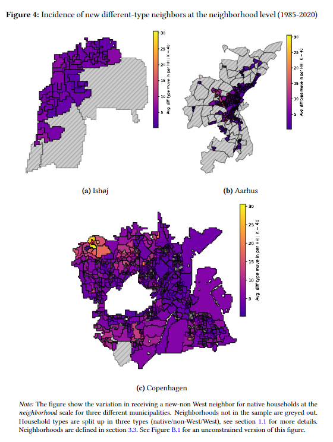

# Love thy neighbor?

Does the ethnicity of your nearest neighbor affect your propensity to move? To provide causal evidence on this question, I use administrative data with precise geospatial information and implement a nearest-neighbor research design that compares households within the same neighborhood who receive different-type neighbors as their nearest neighbor (rank 1-3) compared to ones who receive them "just down the road" (rank 4-6). Between Danish and non-Western households, I find assymetry in reponses: Native Danish households increase their propensity to move within 2 years by approxmiately 1.6 percent compared to their baseline exit rate, when they receive a new non-Western household as their *nearest* neighbor. In contrast, non-Western households show no such response. This effect is primarily driven by low-SES native households responding to low-SES non-Western neighbors. These findings provide causal evidence of individually motivated segregation as theorized by Schelling ([1971](https://www.tandfonline.com/doi/abs/10.1080/0022250X.1971.9989794)).

## Project structure
This is my master's thesis on Schelling behavior. To facilitate reproducibility, I have included all codes used in the paper. These are found in the `src` folder. Utility functions are found in the src/dst folder. 

- `0_main.sh`: A `bash` script that executes all scripts in succession. 
- `1_data_parse.py`: Fetches administrative data sets and saves these as parquet datasets for speedy computation. 
- `2.1_merge.py`: Parses key geospatial dataset and merges a few key personal identifiers.
- `2.2_network_householdz.py`: Partitions sequences to one household, see household definition in section 3.5 in the paper for more details.
- `2.3_neighborhood_maxp.py`: Delinates fixed neighborhoods.
- `2.4_KNN_network.py`: Creates KD-tree for each address, then "populates" it such that each households living at an address has a *K* number of neighbors at any point. Saves it as a graph dataset, household are nodes and spatial-temporal overlap with other *K* nearest neighbors as edges.
- `2.4_KNN_network_big.py`: Same as above, except for *K=100* nearest neighbors.
- `2.5_KNN_desriptives.py`: Descriptive statistics on the network data.
- `2.6_KNN_descriptives_maps.py`: Geographical descriptives on the network data.
- `2.7_KNN_panel.py`: Constructs the panel dataset to be used in the regressions. 
- `3_regz.py`: All regression models used in the paper. 

I have included a `env.yaml`-file to recreate the conda env. 